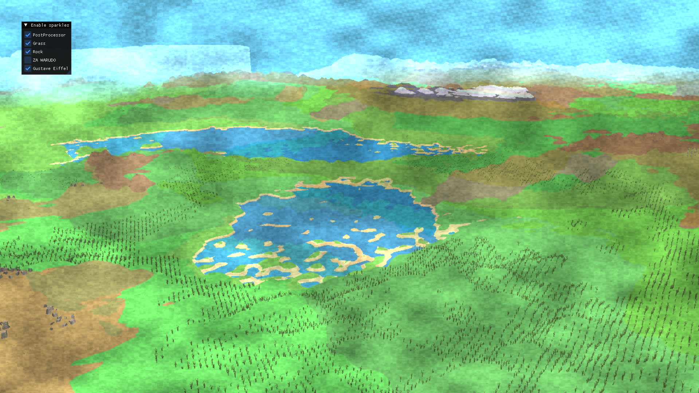
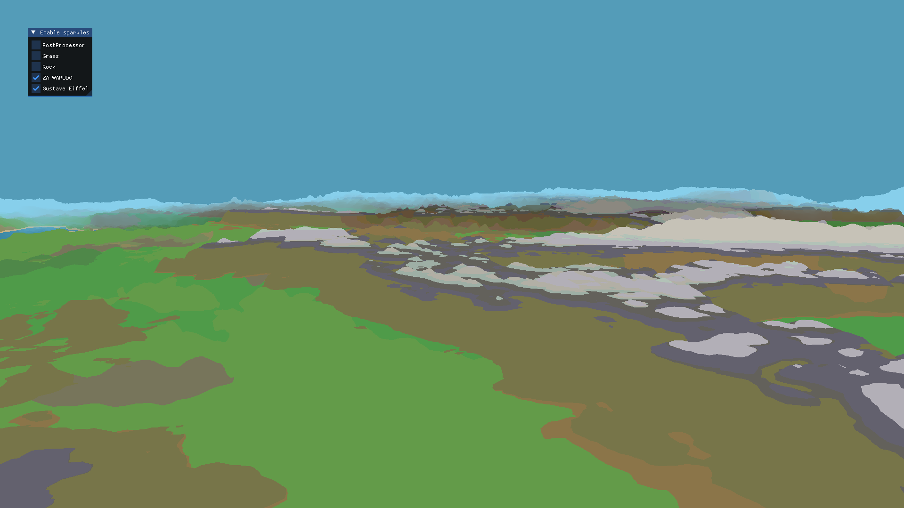
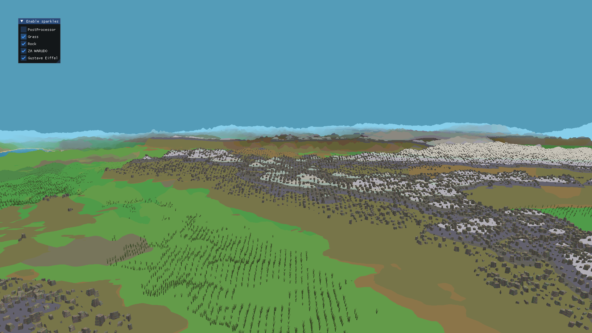
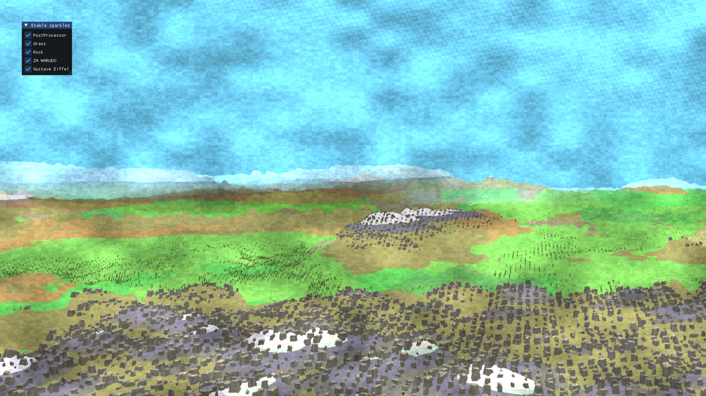
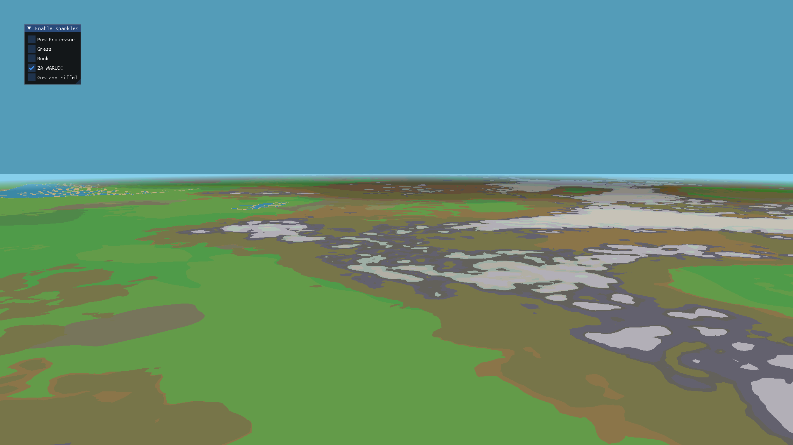

# Générateur de Terrain Procédural – OpenGL



## Objectif du projet

Ce projet a pour but de **générer un terrain procédural** en utilisant **OpenGL** et différents types de **shaders avancés** (compute, geometry, fragment).

Le rendu final combine :
- un **terrain généré à partir de bruit fractal** (Perlin/fBm),
- des **masques pour les montagnes et les lacs**,
- et des **effets visuels stylisés** (grain de papier, roches procédurales).

Le tout pour obtenir un **fond d’écran procédural pas très beau, mais honnête**

---

## Principe général

### 1. Génération du terrain
Le terrain est calculé dans un **compute shader** :
- Chaque pixel correspond à une **coordonnée du terrain**.
- On utilise du **bruit de Perlin** combiné en **fBm** (Fractal Brownian Motion).
- Des variantes comme **turbulence** et **ridge noise** ajoutent des détails.
- Le **warping des coordonnées** casse les motifs répétitifs.

Résultat -> une **heightmap** complexe représentant les reliefs.

---

### 2. Masques géographiques

- 'mountainMask()' -> zones montagneuses (rehausse la hauteur).
- 'lakeMask()' -> zones dépressionnaires (forme des lacs).

Les masques permettent de donner une **structure logique** au relief (montagnes, plaines, lacs...).



---

### 3. Ajout d’éléments procéduraux

Un **geometry shader** ajoute des **rochers/herbes** selon :
- la **hauteur** (pas dans l’eau, ni sur les pics),
- la **densité locale** (calculée via un bruit),
- la **distance caméra** (LOD dynamique).

Chaque rocher/herbe est **généré à la volée** avec une forme, taille et orientation aléatoires.



---

### 4. Effet papier et stylisation

Un **shader de post-processing** applique un effet de **grain de papier** :
- basé sur du **Voronoi** et du **noise**,
- pour donner un aspect “dessiné” au rendu,
- avec des variations locales et globales du grain.



---

## Pipeline OpenGL

```

[Compute Shader] → Génère la heightmap
↓
[Vertex Shader] → Construit la géométrie du terrain
↓
[Geometry Shader] → Ajoute rochers et détails
↓
[Fragment Shader] → Calcule la couleur et l’éclairage
↓
[Post-process Shader] → Effet papier / grain / ambiance
```

---

## Compilation et exécution

### Prérequis
- CMake >= 3.10
- OpenGL >= 4.3
- GLFW, GLEW / GLAD

### Commandes
```bash
cmake -S . -B build
cd build
make
./Opengl
```

Le projet se lancera avec une fenêtre affichant le terrain généré.

---

## Paramètres ajustables

Les principaux **uniforms** permettent d’expérimenter :

| Nom           | Description                              |
| ------------- | ---------------------------------------- |
| `uOctaves`    | Nombre d’octaves dans le fBm             |
| `uLacunarity` | Fréquence entre les octaves              |
| `uGain`       | Atténuation de l’amplitude               |
| `uScale`      | Zoom global sur le terrain               |
| `uSeed`       | Position de départ (nouvelle génération) |

Ainsi, chaque exécution peut produire un **monde unique**

---

## À propos

Projet étudiant en génération procédurale avec **OpenGL 4.3**.
Objectif : expérimenter la **création de terrains naturels et stylisés** à partir de **maths et de bruit**.

---

### Galerie

| Terrain                             | Masques                         | Rochers                         | Effet Papier                   |
| ----------------------------------- | ------------------------------- | ------------------------------- | ------------------------------ |
|  |  |  |  |

---

**Auteur** : *Igor POTARD*

